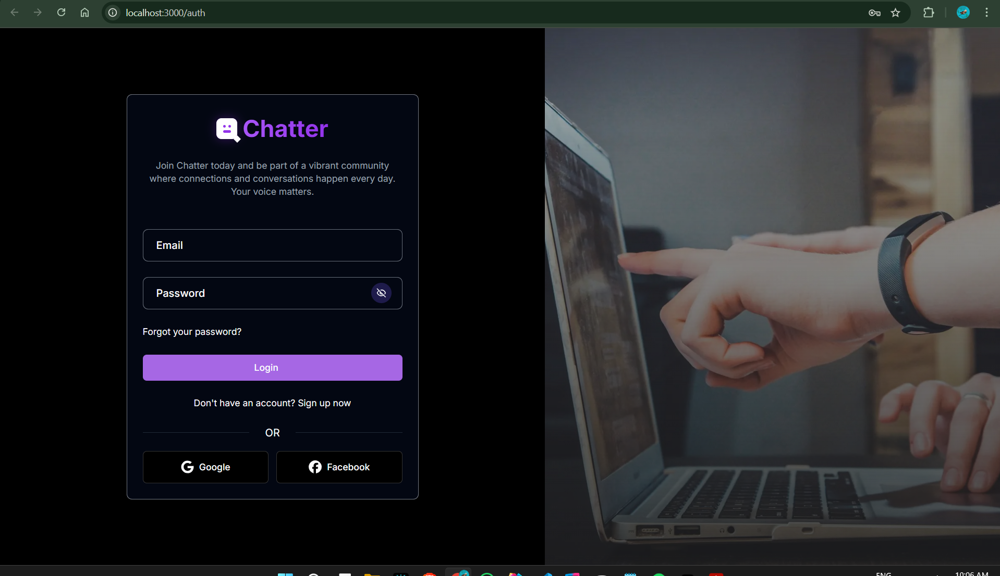

# **Chatter - Social Media Platform**

This project is a social media platform developed using modern web technologies. Users can post, interact, message, and customize their profiles. It supports many modern features such as English language support and dark/light mode.

### 🔑 **Features:**

- **Authentication:**
  - Strong and secure authentication.
  - Login with popular service providers.
  - Sending the password change by mail.

- **Posts:**
  - Share, delete and edit posts.
  - Filter posts (by category, search text or trending tags).
  - Commenting on posts, liking, saving, resharing (repost).

- **User Interactions:**
  - User search and suggested users.
  - Sending follow request, accepting/rejecting, unfollowing.
  - Browse the desired person's profile.
  - Posts that the user liked, commented on or shared.

- **Messaging and Notifications:**
  - Live messaging.
  - Start and delete chats.
  - Send, read and delete notifications.

- **Other Features:**
  - English language support.
  - Dark/Light mode switching.
  - Profile customization (profile photo, bio, username, etc.).

### 🔨 **Technologies Used:**

### 💻 **Frontend:**

- **Next.js**: React-based framework used for server-side rendering (SSR) and client-side rendering (CSR).
- **Shadcn**: Used to easily create UI components.
- **Lucide React**: For user interface icons.
- **Tailwind CSS**: User interface design library.
- **React Hook Form** and **Zod**: Form validation and management.
- **Next Themes**: Switch between dark and light mode.

### 🌐 **Backend:**

- **Prisma**: Used as ORM.
- **PostgreSQL**: Database system.
- **Bcryptjs**: For hashing password with encryption algorithm.
- **Firebase Storage**: Used for image storage.
- **NextAuth**: Authentication and session management.
- **Socket.IO**: Real-time communication for live messaging and notifications.

### 🌐 **Devops:**

- **Docker** : For application containerization

### 📋 **Other Tools:**

- **Hugging Face Inference API**: Machine learning model for post categorization.
- **Next Intl**: Internationalization support.
- **Resend & React Email**: Password reset email sending.
- **TypeScript**: For type safety and development experience.
- **uuid**: To create a unique id.
- **day.js**: For date and time based transactions.

### Desktop View



## 🔧 **Setup**

1.**Download the repository**

```
git clone <your-repository-url>
```

2.**Enter the project directory**

```
cd next-js-social-media-app
```

3.**Install Required Dependencies**

```
npm install
```

4.**Create a postgres database on vercel if it doesn't exist**

You can open an account via Vercel and create a postgres database from the storage tab.

5.**Create an .env file with the following content in the same directory**

**Attentions:**

- You can get variables starting with POSTGRES_DB from the .env tab of the postgres database you created.
- You can start a firebase project and import Firebase variables.

```
POSTGRES_DB_PRISMA_URL=<YOUR_VERCEL_POSTGRES_DATABASE_URL>
POSTGRES_DB_URL_NO_SSL=<YOUR_VERCEL_POSTGRES_DATABASE_NO_SSL_URL>
POSTGRES_DB_USER=<YOUR_VERCEL_POSTGRES_DATABASE_USER>
POSTGRES_DB_HOST=<YOUR_VERCEL_POSTGRES_DATABASE_HOST>
POSTGRES_DB_PASSWORD=<YOUR_VERCEL_POSTGRES_DATABASE_PASSWORD>
POSTGRES_DB_DATABASE=<YOUR_VERCEL_POSTGRES_DATABASE>

NEXT_PUBLIC_FIREBASE_API_KEY=<FIREBASE_API_KEY>
NEXT_PUBLIC_FIREBASE_AUTH_DOMAIN=<FIREBASE_AUTH_DOMAIN>
NEXT_PUBLIC_FIREBASE_PROJECT_ID=<FIREBASE_PROJECT_ID>
NEXT_PUBLIC_FIREBASE_STORAGE_BUCKET=<FIREBASE_STORAGE_BUCKET>
NEXT_PUBLIC_FIREBASE_MESSAGING_SENDER_ID=<FIREBASE_MESSAGING_SENDER_ID>
NEXT_PUBLIC_FIREBASE_APP_ID=<FIREBASE_APP_ID>

NEXTAUTH_URL=http://localhost:3000/api/auth
NEXTAUTH_SECRET=<SECRET_KEY>

GOOGLE_CLIENT_ID=<GOOGLE_CLIENT_ID>
GOOGLE_CLIENT_SECRET=<GOOGLE_CLIENT_SECRET>

FACEBOOK_CLIENT_ID=<FACEBOOK_CLIENT_ID>
FACEBOOK_CLIENT_SECRET=<FACEBOOK_CLIENT_SECRET>

RESEND_API_KEY=<RESEND_API_KEY>

NEXT_PUBLIC_BASE_URL=http://localhost:3000
NEXT_PUBLIC_SOCKET_PORT=3001

HUGGING_FACE_API_TOKEN=<HUGGING_FACE_API_TOKEN>
HUGGING_FACE_API_URL=<HUGGING_FACE_API_URL>

NEXT_PUBLIC_DEFAULT_LOGO_URL=https://example.com/default-logo.png
NEXT_PUBLIC_DEFAULT_BACKDROP_URL=https://example.com/default-backdrop.png


```

6.**Sync the database using Prisma:**

```
npx prisma migrate dev --name init
```

7.**Start the application**

```
npm run dev
```

8.**Show in browser**

Go to `http://localhost:3000` in your browser.

## 🔧 **Setup with Docker**

**NOTE**: For this process, Docker must be installed on your computer.

1.**Add 3 new values ​​to the .env file**

```
POSTGRES_DB = <POSTGRES_DB_NAME>
POSTGRES_USER = <POSTGRES_DB_USERNAME>
POSTGRES_PASSWORD = <POSTGRES_DB_PASSWORD>
```

2.**Update the schema file in the prisma folder**

```
datasource db {
  ....
  url       = env("DATABASE_URL")
}
```

3.**Add postgres link url to .env file**

```
# Note : The default value of postgres db schema is public
# Note : You can put vercel postgres database env variables in the comment line
DATABASE_URL = "postgresql://<POSTGRES_DB_USERNAME>:<POSTGRES_DB_PASSWORD>@<POSTGRES_DB_HOST>:5430/<POSTGRES_DB_NAME>?schema=<POSTGRES_DB_SCHEMA>"
```

4.**Run docker command**

```
docker compose up -d
```

5.**Run the command in the terminal to reflect the tables in our prisma schema to the docker postgres database**

```
npx prisma migrate dev --name init
```

6.**Show in browser**

Go to `http://localhost:3000` in your browser.

## Contribute 🤝

- You can use the Issues tab for bug reports and suggestions.
- If you want to contribute to the project, create a fork and submit a pull request.
